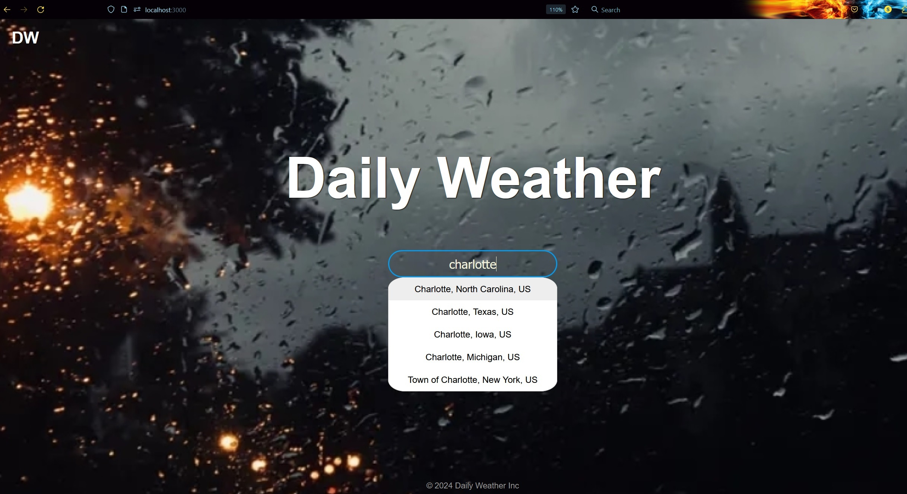

# DailyWeather App ☀️🌧️🌎

DailyWeather is a user-friendly application that provides current weather conditions and a 5-day forecast for cities worldwide. With features like an intelligent autocomplete search bar, geolocation support, and detailed weather reports, this app makes staying informed about the weather simple and seamless.

---

## **Table of Contents** 📋

1. [Overview](#overview)
2. [Features](#features)
   - [Autocomplete Search Bar](#autocomplete-search-bar)
   - [Current Location Feature](#current-location-feature)
   - [Current Weather Display](#current-weather-display)
   - [5-Day Weather Forecast](#5-day-weather-forecast)
   - [Navigation](#navigation)
3. [How to Use](#how-to-use)
4. [Screenshots Overview 🖼](#screenshots-overview-)
5. [Tech Stack 🛠](#tech-stack-)
6. [How to Run the App 🚀](#how-to-run-the-app-)

---

## **Overview**
The DailyWeather app offers a seamless way to search for current weather conditions and access a 5-day weather forecast for cities worldwide. With intuitive navigation and comprehensive weather details, it ensures users can find and view weather information effortlessly.

---

## **Features**

### **Autocomplete Search Bar**
- A dynamic search bar suggests city names as the user types, ensuring accurate and quick searches without needing exact spelling.

### **Current Location Feature**
- The app includes a geolocation button that allows users to fetch weather data for their current location with ease.

### **Current Weather Display**
- Displays detailed weather information, including:
  - City name with a weather condition image.
  - Current temperature and weather conditions.
  - Visibility, wind speed, pressure, and humidity.

### **5-Day Weather Forecast**
- Accessible via the "5 Day Forecast" button from the current weather page.
- Provides a detailed day-by-day breakdown of the weather.

### **Navigation**
- The **DW app logo** acts as a home button, quickly returning users to the homepage.
- The search bar, available on multiple pages, allows users to navigate directly to weather reports for other cities.
- A dedicated **back button** in the 5-day forecast view navigates back to the current weather page.

---

## **How to Use**

1. **Initiating a Search**:
   - Type the city name into the search bar on the homepage.
   - Use the autocomplete feature for quick suggestions.

2. **Accessing Current Weather**:
   - Click a suggestion from the autocomplete list or press "Search" to view the current weather for the selected city.

3. **Using Current Location**:
   - Click the **Current Location** button on the homepage.
   - Accept the location prompt to display the weather for your current area.

4. **Exploring Weather Details**:
   - Use the **"5 Day Forecast"** button to access extended weather information.

5. **Navigating Through the App**:
   - Click the **DW app logo** to return to the homepage.
   - Use the back button in the 5-day forecast view to return to the last searched city's weather details.

6. **API Key Setup**:
   - Replace the default `API_KEY` variable in the app by creating a `.env` file in the root directory and adding:
     ```
     REACT_APP_API_KEY=your_api_key_here
     ```

---

## **Screenshots Overview 🖼**

### **Home Page**


### **Use Location Feature**


### **Search Feature**


### **Current Weather Forecast**


### **5-Day Weather Forecast**


---

## **Tech Stack 🛠**
- **Frontend:** React (Create React App)
- **API:** [OpenWeatherMap API](https://openweathermap.org/api)

---

## **How to Run the App 🚀**
1. Clone the repository:
- git clone https://github.com/obrito00/WeatherApp
- cd WeatherApp

2. Install dependencies:
npm install

3. Obtain the API key from openweathermap.org/api:
- create the .env file
- Add: Add: REACT_APP_API_KEY=your_api_key

4. Start the App:
npm start